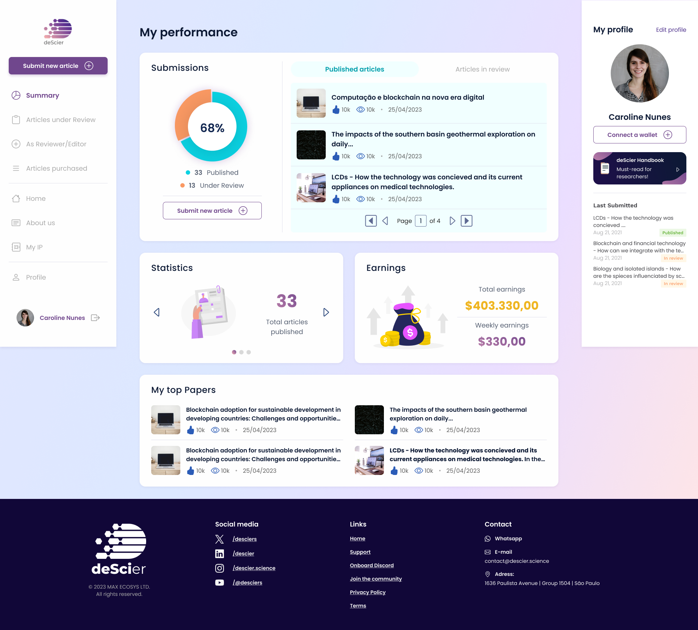

<h1 align="center">
  
</h1>
  <p align="center">The deScier project represents an innovation in scientific publishing, making it more accessible, faster, and fairer. Our decentralized approach increases transparency and empowers authors, ensuring 100% ownership and control over their work while significantly reducing costs. Our differentiator includes unique peer review processes and advanced technologies, promoting global collaboration and unprecedented co-creation. With deScier, we democratize access to scientific publishing, driving the advancement of knowledge on a global scale and demonstrating the efficiency and benefits of our approach compared to traditional methods.</p>
<h4 align="center">
 <p align="center">
   
   
   
   
   
</p>
</h4>



## Introduction

The **[deScier – Decentralized Science](https://descier.science/)** is a project that represents a revolution in scientific publishing, offering an alternative to the expensive and restrictive traditional model. deScier is a collaborative community dedicated to advancing human knowledge by facilitating scientific publications and funding. Our goal is to eliminate the barriers of traditional publishing and promote a new era of academic communication.

We offer a decentralized scientific publishing platform that aims to improve transparency, reduce the influence of intermediaries, and promote fair access to scientific knowledge. With fast and user-friendly processes, we ensure peer review and maintain 100% of the copyright with the authors.

We believe in the power of collaborative work and co-creation, accessible to everyone in a shared economy. Our global community provides guidance, support, and fosters innovation and collaboration, allowing authors, editors, reviewers, and designers to work together on high-quality publications and advance knowledge faster.

## Features

-  **Scientific document submission system:** An intuitive platform for scientists to submit their work, simplifying the publication process.

-  **Collaborative review and approval:** A collaborative system where reviewers, editors, and administrators can effectively evaluate and approve scientific documents, ensuring quality and integrity.

-  **Differentiated roles:** Customized interfaces for authors, reviewers, editors, and administrators, providing each user with an optimized experience and specific functionalities for their role.

-  **Library of published articles:** Access to a vast library of articles, including both paid and open access content, enriching the knowledge available to the scientific community.

-  **Purchase system for paid articles:** A secure and user-friendly solution for purchasing paid scientific articles, allowing immediate access to cutting-edge research.

## Cloning the repository and runing locally

Clone the repository by running the following command in your terminal:

```console
git clone https://github.com/rafaeelricco/de-scier-plataform.git
```

Once the repository is cloned, navigate to the project folder using the terminal and install the project dependencies:

    yarn install

After the installation is complete, you can start the local development server:

    yarn run dev

Open your web browser and visit http://localhost:3000 to see the result. The application should be up and running locally on your machine.

I recommend using the **[Inline Fold](https://marketplace.visualstudio.com/items?itemName=moalamri.inline-fold)** extension for Visual Studio Code when working with Tailwind CSS in this project. This extension allows for a cleaner and more organized view when multiple Tailwind CSS classes are used on a single element.

## Setting the environment variables

Before running the project you need to set up environment variables. Create a .env file at the root directory and add the following variables:

```
NEXT_PUBLIC_NODE_ENV=<your-env>
NEXT_PUBLIC_API_URL=<your-api-url>

NEXTAUTH_SECRET=<your-secret> # Generate using `jose newkey -s 512 -t oct -a HS512` ou `openssl rand -base64 32`

GOOGLE_ID=<your-google-id>
GOOGLE_SECRET=<your-google-secret>

WEB3AUTH_CLIENT_ID=<your-web3auth-client-id>
WEB3AUTH_CLIENT_ID_TEST=<your-web3auth-client-id-test>

ALCHEMY_API_URL=<your-alchemy-api-url>
ALCHEMY_API_URL_TEST=<your-alchemy-api-url-test>
```
